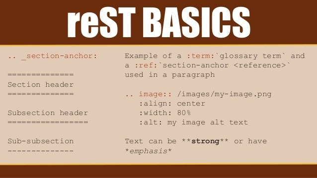

.. hello-rest documentation master file, created by
   sphinx-quickstart on Wed Jul 15 16:01:58 2020.
   You can adapt this file completely to your liking, but it should at least
   contain the root `toctree` directive.

RestructedText 문법
===================

문자열 형식
-----------

- *이탤릭*
- **볼드**
- ``문자열``

제목
----

- #, for parts
- \*, for chapters
- =, for sections
- -, for subsections
- ^, for subsubsections
- “, for paragraphs

.. _내부링크:

링크
----

- `<https://www.sphinx-doc.org/>`_
- `문자열 형식`_
- 내부링크_
- :ref:`내부링크`

목록
----

* This is a bulleted list.
* It has two items, the second
  item uses two lines. (note the indentation)

- This is a bulleted list.
- It has two items, the second
  item uses two lines. (note the indentation)

1. This is a numbered list.
2. It has two items too.
#. This is a numbered list.
#. It has two items too.

지시자
------

.. code-block:: html
   :linenos:

   <h1>code block example</h1>

코드
------

This is a simple example with colon::

    import math
    print('import done')

This is a simple example without colon. ::

    import math
    print('import done')

.. literalinclude:: sample.py
    :language: python

표
--

- 간단한 표

+---------+---------+-----------+
| 1       |  2      |  3        |
+---------+---------+-----------+

- 셀이 있는 표 1

+------------+------------+-----------+
| Header 1   | Header 2   | Header 3  |
+============+============+===========+
| body row 1 | column 2   | column 3  |
+------------+------------+-----------+
| body row 2 | Cells may span columns.|
+------------+------------+-----------+
| body row 3 | Cells may  | - Cells   |
+------------+ span rows. | - contain |
| body row 4 |            | - blocks. |
+------------+------------+-----------+

- 셀이 있는 표 2

=====  =====  ======
   Inputs     Output
------------  ------
  A      B    A or B
=====  =====  ======
False  False  False
True   False  True
=====  =====  ======

- CSV 표

.. csv-table::
   :header: "name", "firstname", "age"
   :widths: 20, 20, 10

   "Smith", "John", 40
   "Smith", "John, Junior", 20

파이썬 코드 문서화
------------------

.. currentmodule:: sample
.. autofunction:: square

그림
----

박스
----

.. seealso:: This is a simple **seealso** note.

.. note:: This is a **note** box.

.. warning:: note the space between the directive and the text.

.. topic:: Your Topic Title

   Subsequent indented lines comprise
   the body of the topic, and are
   interpreted as body elements.

.. sidebar:: Sidebar Title
   :subtitle: Optional Sidebar Subtitle

   Subsequent indented lines comprise
   the body of the sidebar, and are
   interpreted as body elements.

.. comments

바꾸기
-------

파이썬 링크는 PythonLink_.

파이썬 이름은 |파이썬영문이름|.

.. _PythonLink: http://www.python.org/

.. |파이썬영문이름| replace:: Python

주석
-------

내용과 각주 [#ref1]_ .

.. rubric:: 각주

.. [#ref1] 각주에 대한 설명.

인용
-----

[rest예제]_ 을 보자.

.. [rest예제] https://thomas-cokelaer.info/tutorials/sphinx/rest_syntax.html.

수식
-----

.. math::

    n_{\mathrm{offset}} = \sum_{k=0}^{N-1} s_k n_k
